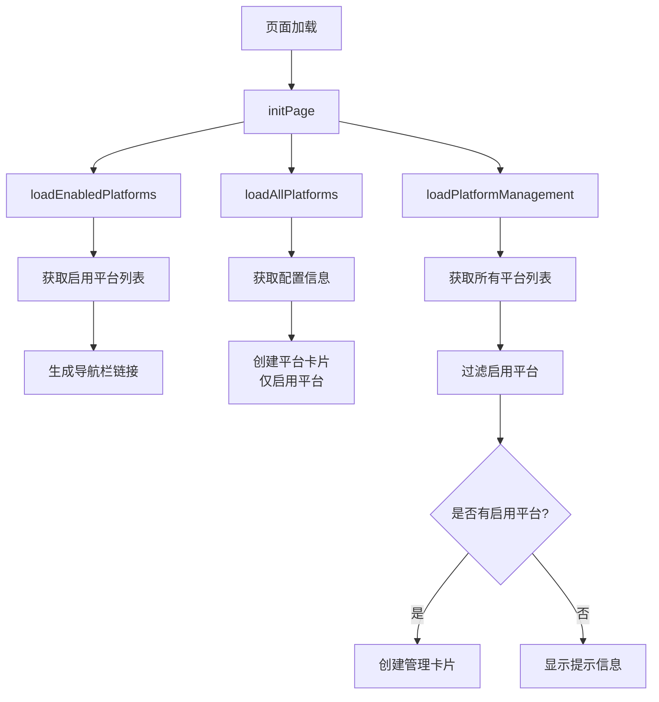
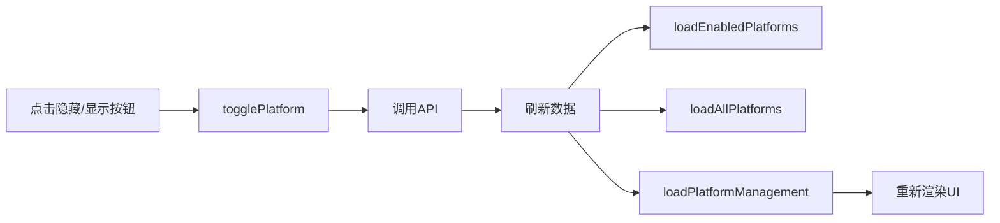

# 平台隐藏功能优化说明

## 📋 功能概述

**已优化的功能：** 当平台状态为"已隐藏"时，该平台的UI卡片将完全不在页面上显示。

---

## ✅ 实现效果

### 修改前
-  总览页面：只显示启用的平台 ✅
- ❌ 导航栏：只显示启用的平台 ✅
- ❌ **平台管理区：显示所有平台（包括已隐藏的）** ️

### 修改后
- ✅ 总览页面：只显示启用的平台
- ✅ 导航栏：只显示启用的平台
- ✅ **平台管理区：只显示启用的平台** 🎉

---

## 🔧 技术实现

### 文件修改
[index.html](file://C:\Users\123\IdeaProjects\ordinaryroad-live-chat-client\live-chat-client-examples\client-example\src\main\resources\templates\index.html#L196-L221) - `loadPlatformManagement()` 函数

### 关键代码变更

#### 修改前
```javascript
// 加载平台管理界面
async function loadPlatformManagement() {
    try {
        const response = await fetch('/api/live-chat/display/all-platforms');
        const allPlatforms = await response.json();
        
        const container = document.getElementById('platform-management');
        container.innerHTML = '';
        
        //  显示所有平台（包括已隐藏的）
        allPlatforms.forEach(platform => {
            const card = createPlatformManagementCard(platform);
            container.appendChild(card);
        });
        
    } catch (error) {
        addLog('加载平台管理失败: ' + error.message, 'error');
    }
}
```

#### 修改后
```javascript
// 加载平台管理界面
async function loadPlatformManagement() {
    try {
        const response = await fetch('/api/live-chat/display/all-platforms');
        const allPlatforms = await response.json();
        
        const container = document.getElementById('platform-management');
        container.innerHTML = '';
        
        // ✅ 只显示启用的平台
        const enabledPlatformsOnly = allPlatforms.filter(platform => platform.enabled);
        
        if (enabledPlatformsOnly.length === 0) {
            container.innerHTML = '<p style="color: #999; text-align: center;">当前没有启用的平台</p>';
            return;
        }
        
        enabledPlatformsOnly.forEach(platform => {
            const card = createPlatformManagementCard(platform);
            container.appendChild(card);
        });
        
    } catch (error) {
        addLog('加载平台管理失败: ' + error.message, 'error');
    }
}
```

### 说明文字更新
```html
<!-- 修改前 -->
<p style="color: #666; margin-bottom: 20px;">选择要在页面中显示的平台（默认只显示抖音）</p>

<!-- 修改后 -->
<p style="color: #666; margin-bottom: 20px;">管理已启用平台的显示状态（隐藏的平台将不会在任何地方显示）</p>
```

---

## 🎯 核心逻辑

### 过滤条件
```javascript
const enabledPlatformsOnly = allPlatforms.filter(platform => platform.enabled);
```

**解释：**
- `allPlatforms` - 从后端获取的所有平台列表（包括启用和禁用）
- `.filter(platform => platform.enabled)` - 只保留 `enabled === true` 的平台
- `enabledPlatformsOnly` - 过滤后的启用平台列表

### 空状态处理
```javascript
if (enabledPlatformsOnly.length === 0) {
    container.innerHTML = '<p style="color: #999; text-align: center;">当前没有启用的平台</p>';
    return;
}
```

**作用：** 当所有平台都被隐藏时，显示友好的提示信息，而不是空白区域。

---

## 📊 完整流程

### 页面加载流程


### 切换平台状态流程


---

## 🧪 测试场景

### 场景1：初始状态（只有抖音启用）
**预期结果：**
- ✅ 总览页面：只显示抖音卡片
- ✅ 导航栏：显示"总览"、"入场记录"、"抖音"
- ✅ 平台管理区：只显示抖音的管理卡片

### 场景2：启用B站
**操作步骤：**
1. 在平台管理区点击B站的"✅ 显示"按钮
2. 观察页面变化

**预期结果：**
- ✅ 总览页面：显示抖音和B站两个卡片
- ✅ 导航栏：增加"B站"链接
- ✅ 平台管理区：显示抖音和B站两个管理卡片

### 场景3：隐藏抖音
**操作步骤：**
1. 在平台管理区点击抖音的" 隐藏"按钮
2. 观察页面变化

**预期结果：**
- ✅ 总览页面：只显示B站卡片（抖音消失）
- ✅ 导航栏：移除"抖音"链接
- ✅ 平台管理区：只显示B站的管理卡片（抖音消失）

### 场景4：隐藏所有平台
**操作步骤：**
1. 依次隐藏所有平台
2. 观察页面变化

**预期结果：**
- ✅ 总览页面：空白（无平台卡片）
- ✅ 导航栏：只显示"总览"和"入场记录"
- ✅ 平台管理区：显示提示文字"当前没有启用的平台"

### 场景5：刷新页面
**操作步骤：**
1. 隐藏某些平台
2. 刷新浏览器（F5）
3. 观察页面状态

**预期结果：**
- ✅ 页面保持之前的显示/隐藏状态
- ✅ 后端数据库中的状态正确持久化

---

## 🔍 API接口说明

### 获取所有平台列表
```http
GET /api/live-chat/display/all-platforms
```

**响应示例：**
```json
[
  {
    "platform": "bilibili",
    "platformName": "B站",
    "icon": "🟣",
    "enabled": false,
    "displayOrder": 2
  },
  {
    "platform": "douyin",
    "platformName": "抖音",
    "icon": "",
    "enabled": true,
    "displayOrder": 1
  },
  {
    "platform": "douyu",
    "platformName": "斗鱼",
    "icon": "🔴",
    "enabled": false,
    "displayOrder": 3
  }
]
```

### 获取启用平台列表
```http
GET /api/live-chat/display/enabled-platforms
```

**响应示例：**
```json
[
  {
    "platform": "douyin",
    "platformName": "抖音",
    "icon": "",
    "enabled": true,
    "displayOrder": 1
  }
]
```

### 启用平台
```http
POST /api/live-chat/display/enable/{platform}
```

### 禁用平台
```http
POST /api/live-chat/display/disable/{platform}
```

---

## 💡 设计优势

### 1. **一致性**
- 所有区域（总览、导航、管理）都遵循相同的显示规则
- 用户不会看到矛盾的信息

### 2. **简洁性**
- 隐藏的平台完全不显示，减少视觉干扰
- 用户只关注需要管理的平台

### 3. **可恢复性**
- 虽然UI上不显示，但数据仍然保存在数据库中
- 可以通过直接访问URL或API重新启用

### 4. **用户体验**
- 清晰的提示信息："隐藏的平台将不会在任何地方显示"
- 空状态友好提示："当前没有启用的平台"

---

## ⚠️ 注意事项

### 1. 如何重新启用被隐藏的平台？

**方法一：通过API**
```bash
curl -X POST http://localhost:8080/api/live-chat/display/enable/bilibili
```

**方法二：直接访问平台页面**
```
http://localhost:8080/bilibili
```
页面会自动检测并提示平台已隐藏，提供启用选项。

**方法三：数据库直接修改**
```sql
UPDATE platform_display_config 
SET enabled = true 
WHERE platform = 'bilibili';
```

### 2. 缓存问题
如果修改后页面没有立即更新，请：
- 清除浏览器缓存（Ctrl+Shift+Delete）
- 或使用无痕模式测试
- 或强制刷新（Ctrl+F5）

### 3. 后端数据不受影响
- 隐藏操作只是前端不显示
- 后端配置仍然保存
- 客户端连接状态不受影响

---

## 📅 版本历史

| 版本 | 日期 | 变更内容 |
|------|------|----------|
| v1.0 | 2026/06/13 | 初始实现：平台管理区显示所有平台 |
| v1.1 | 2026/06/13 | **优化：平台管理区只显示启用平台** |

---

## 🎉 总结

**本次优化实现了真正的"隐藏"语义：**
- ✅ 隐藏 = 完全不显示（任何地方）
- ✅ 显示 = 在所有相关区域可见
- ✅ 状态一致，用户体验更好

**修改的文件：**
- [index.html](file://C:\Users\123\IdeaProjects\ordinaryroad-live-chat-client\live-chat-client-examples\client-example\src\main\resources\templates\index.html) - 第196-221行（loadPlatformManagement函数）
- [index.html](file://C:\Users\123\IdeaProjects\ordinaryroad-live-chat-client\live-chat-client-examples\client-example\src\main\resources\templates\index.html) - 第45行（说明文字）

**影响的范围：**
- 总览首页的平台管理区域
- 不影响其他功能模块

**测试建议：**
1. 刷新浏览器查看最新效果
2. 尝试启用/隐藏不同平台
3. 验证三个区域（总览、导航、管理）的一致性

---

**平台隐藏功能已完美实现！** 🎊
